# SCOUT: three-camera mission awareness

> Current scope (2026-09-28): keep the existing IMX678 + USB architecture.
> The three-camera proposal below is deferred because mixed IMX678/IMX568
> simultaneous capture currently fails. The next proposed extension is
> [browser-controlled Whisper Medium STT and Supertonic TTS](VOICE_ARCHITECTURE.md),
> with [YAML configuration](scout-voice.example.yaml).

SCOUT demonstrates an onboard visual assistant for drone customers: find a
subject, inspect visible details, monitor a payload area, and review the images
supporting each observation. Inference runs on the Modalix SoM devkit; Neat
Insight carries video and metadata to the browser.

This is the proposed three-camera architecture. The current application supports
the IMX678 MIPI camera and eMeet Nova USB camera. The e-con IMX568 path and
three-view console still need implementation and hardware validation.

## Cameras and their missions

| Camera | Hardware and connection | Role | Capture status |
|---|---|---|---|
| MIPI 1 — Overview | e-con IMX678; MIPI connection to the SoM carrier using Type-A straight cables | Find people or objects in the wider scene; maintain local tracks and movement trails | Validated in SCOUT at 1920×1080, 30 FPS |
| MIPI 2 — Motion / Inspection | e-con IMX568 global-shutter camera with integrated FPGA; planned second MIPI input | Provide a closer viewpoint for inspecting a moving subject or payload detail | Planned; output format, supported modes and application FPS require integration testing |
| USB — Landing / Payload Watch | eMeet Nova; USB MJPEG capture | Detect watched objects entering or leaving a marked mat, table or payload area | Validated in SCOUT at 1280×720, 15 FPS |

The FPGA is part of the IMX568 camera hardware. Its processing functions are
unspecified in this design. YOLO and Gemma inference remain assigned to Modalix.
The existing one-camera IMX678 overlay does not establish support for the mixed
IMX678/IMX568 pair; sensor/FPGA drivers and the carrier configuration need checking.
Previously measured frame rates are not a prediction for the three-camera load.

## Application architecture

```mermaid
flowchart TB
    C1["MIPI 1: e-con IMX678<br/>Overview"]
    C2["MIPI 2: e-con IMX568<br/>Global shutter + integrated FPGA<br/>PROPOSED"]
    C3["USB: eMeet Nova<br/>Landing / payload view"]

    subgraph BOARD["Modalix SoM devkit — SCOUT"]
        CAP["Per-camera capture adapters<br/>Bounded frame buffers + timestamps"]
        ENC["Persistent H.264 encoders<br/>One per camera stream"]
        YOLO["YOLO26 detection<br/>Neat / Modalix MLA"]
        TRACK["Per-camera tracking<br/>Watch-region occupancy"]
        MISSION["Mission coordinator<br/>Camera selection + event handling"]
        SNAP["Snapshot scheduler<br/>Select exact crop<br/>Pause capture and drain YOLO"]
        GEMMA["Gemma 4 E4B<br/>Neat GenAI / Modalix MLA"]
        EVID["Shared evidence timeline<br/>Camera + image + time + observation"]
        API["SCOUT HTTPS console<br/>Mission API + evidence images"]

        CAP --> ENC
        CAP --> YOLO --> TRACK --> MISSION
        CAP -->|"Selected frame"| SNAP
        MISSION -.->|"Inspection request"| SNAP
        SNAP -->|"480 × 480 JPEG + question"| GEMMA
        GEMMA -->|"Verdict + explanation"| MISSION
        MISSION --> EVID --> API
        MISSION <-->|"Commands / state"| API
        SNAP -.->|"Pause / resume"| CAP
        SNAP -.->|"Drain / recreate"| YOLO
    end

    C1 -->|"MIPI"| CAP
    C2 -.->|"Planned MIPI integration"| CAP
    C3 -->|"USB / OpenCV"| CAP
    ENC -->|"H.264 RTP"| INSIGHT["Neat Insight<br/>Companion host"]
    TRACK -->|"Timestamp-matched metadata"| INSIGHT
    INSIGHT -->|"WebRTC video + metadata"| UI["Browser mission console<br/>Three views + controls + evidence"]
    API <-->|"HTTPS"| UI

    classDef proposed fill:#342b18,stroke:#d5a64f,stroke-dasharray:5 5;
    class C2 proposed;
```

Capture feeds video and detection independently. Camera adapters preserve source
identity and timestamps throughout both paths. Today, MIPI supplies NV12 and USB
supplies BGR after MJPEG decoding; the new camera's output must be adapted to its
negotiated format rather than assumed to match either path.

YOLO supplies object classes and boxes. Tracking and region logic on the CPU
turn those detections into local movement and occupancy observations. Gemma
answers a selected visual question about a saved image. It does not run for every
frame or control the aircraft.

The first three-camera version should retain the validated snapshot lifecycle:
load Gemma before capture; close all detector runs before a VLM request; keep
encoders allocated; then recreate capture/detection and resume video. The UI
shows an inspection-pause banner. Concurrent VLM inference and uninterrupted
three-camera capture would require separate validation.

## Visitor use case: find an operator and monitor a payload area

Use an orange vest, a backpack, and a marked table or floor mat. Position MIPI 1
for the room overview, MIPI 2 near the inspection position, and USB over the
marked area. Give the two MIPI views some overlap for an understandable scene.

| Step | Visitor action | SCOUT behavior and evidence |
|---|---|---|
| Find | Enter the overview and request a person wearing an orange vest | MIPI 1 locates a person and shows a local track and digital crop |
| Inspect | Approach MIPI 2, select that view and request an appearance check | Gemma examines the selected subject crop; the console displays its answer and exact image |
| Watch | Place the backpack in the USB watch region, with backpack selected as the watched class | Stable detection produces an Area occupied event and a pulsing dark-red region |
| Explain | Request Inspect area snapshot | Gemma checks the selected region and adds its image and explanation to the timeline |
| Clear | Remove the backpack | Consistent absence produces No watched objects; the live warning clears |
| Report | Open the evidence cards | Review the camera-labelled sequence of observations, timestamps and VLM answers |

These are expected interactions, not predetermined model answers. Gemma may
return yes, no or uncertain; display the actual verdict. No watched objects means
the selected detector classes were not observed, not that every obstruction has
been excluded or landing has been authorized.

The initial workflow uses explicit camera and subject selection. Local tracks
from different cameras are independent; the timeline does not establish that two
observations depict the same person. A later handoff feature could show a possible
match with paired evidence before associating observations across views.

## Browser experience

- One large selected view with three camera tiles: IMX678 Overview, IMX568 + FPGA
  Motion / Inspection, and eMeet Nova Payload Watch.
- Mission controls appropriate to the selected camera, with a live digital crop
  and a separate saved inspection image so old evidence is clearly labelled.
- A shared evidence timeline with camera identity, capture time, source PTS,
  detector events and VLM verdicts.
- Capture availability, detection/stream FPS, observation age and VLM time;
  unknown occupancy when a camera is paused, disconnected or stale.
- A dark-red pulse for an occupied USB region; steady tint with reduced motion.

The existing evidence store is in RAM and bounded to the latest 24 events.
Normal shutdown writes metadata to `last-run.json`, without archiving JPEGs.
Durable mission reports and image storage would be a separate extension.

## Implementation boundaries

| Existing component | Three-camera extension |
|---|---|
| `main.py`: Neat model configuration and MIPI graph | Reuse YOLO configuration; build the supported IMX568 capture/preprocessing path |
| `scout.py`: capture lifecycle, persistent preview, HTTP console and VLM scheduling | Manage three camera sources, their stream channels and coordinated snapshot pauses |
| `scout_state.py`: local tracking and shared mission/evidence state | Scope subject missions and results by camera as well as mission generation |
| `scout_watch.py`: USB capture, region occupancy and recovery | Retain USB's independent watch mission and unknown-state handling |
| `scout_vlm.py`: one bounded Gemma worker | Include camera identity, generation, timestamp and selected image in every inspection job |
| `scout-web/` and shared `web/webrtc.js` | Add the third view and camera selection while retaining video/metadata pairing |

Keep the existing MIPI and USB channel assignments when practical and allocate
a distinct channel for IMX568. All three views share the compute budget, but not
tracking IDs. Validate mixed-camera capture first, then inference and streaming,
then repeated snapshot checks with resumed and correctly aligned overlays.

For the currently runnable two-camera application, see [SCOUT.md](SCOUT.md).
