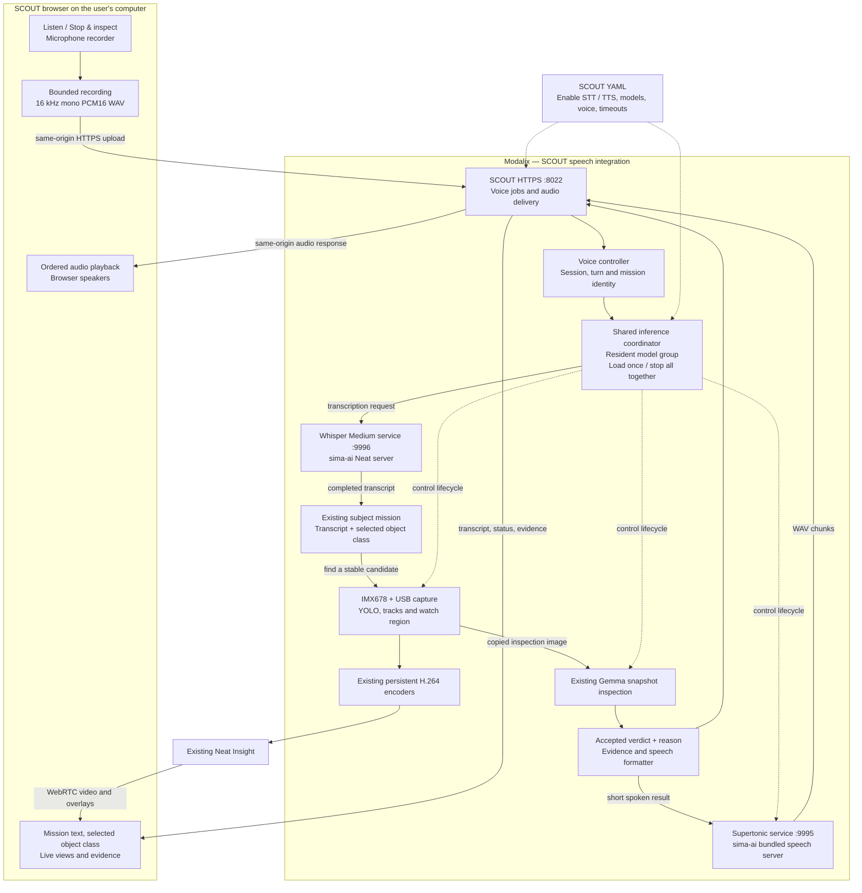

# SCOUT voice architecture: Whisper Medium and Supertonic

Status: implemented with resident models and continuous camera capture.
Whisper Medium, Gemma and Supertonic were validated together on Modalix on
2026-09-28. Retains the current IMX678 MIPI + eMeet Nova USB application.
IMX568 simultaneous capture is outside this scope.

The browser owns the microphone and speakers. The first press of **Listen**
starts recording; the button becomes **Stop & inspect**. The second press stops
recording, releases the microphone, and submits the complete utterance. Whisper
Medium transcribes on Modalix; SCOUT automatically starts a subject mission and
requests inspection using that transcript. Supertonic speaks the accepted
inspection result through the browser.

An active subject mission now repeats inspection every three seconds when Gemma
is free. Subject Focus requires a positive verdict for the same live track;
negative/uncertain/error rechecks clear it. Candidates are tried in turn until
a match, then the confirmed identity is rechecked. Every check keeps evidence;
spoken results repeat only when the track or verdict changes. While recording
or transcribing a new voice mission, checks of the old description are suspended.

## Components and data flow



Speech services bind to loopback and are called only by SCOUT. The browser uses
SCOUT's existing HTTPS origin for both uploads and playback; it does not contact
HTTP speech services directly. Model servers are owned for the application lifetime.
Jarvic's assistant, RAG, tool routing and separate chat server are not needed.

## Reuse from `/workspace/GitHub/sima-ai`

| Existing source | SCOUT integration |
| --- | --- |
| `services/speech/start.py` | Build model-server commands from YAML; preserve artifact-path checks |
| `services/genai_model_server/model_server.py` | Whisper serving, startup/warmup checks, process ownership and shutdown |
| `supertonic-sima/app/examples/speech_server.py` | Supertonic engine and HTTP service |
| `src/jarvic/audio/clients.py` | Reuse `WhisperClient`, `SupertonicClient`, WAV checks and bounded text splitting |
| `src/jarvic/bootstrap/settings.py` | Reuse the Whisper/Supertonic configuration schema |

Whisper accepts multipart `POST /v1/audio/transcriptions` and returns streamed
text events. The existing client waits for `[DONE]`; SCOUT must never submit a
partial transcript as a mission. Supertonic accepts JSON `POST /v1/speech` and
returns WAV audio. Its output sample rate comes from the WAV header.

Use these installed model locations:

- STT: `/media/nvme/llima/models/whisper-medium-a16w8-layered-encoder`
- TTS base assets: `/media/nvme/llima/models/supertonic-3`
- TTS compiled assets: `/media/nvme/llima/models/supertonic-3-sima`
- Existing VLM: `/media/nvme/llima/models/Gemma-4-E4B-it-GPTQ-a16w4-8k-deploy`

The layered Whisper deployment is the variant documented by `sima-ai` for this
runtime. Supertonic uses the compiled vector-field and BF16 vocoder archives,
runtime data, manifests, ONNX text encoder/duration predictor, and voice styles.

## User interaction

1. Select **Find a subject** and an object class, as in current SCOUT.
2. Press **Listen**. Request microphone permission on this user action, stop
   any current reply playback, and show an obvious recording indicator/timer.
   Camera video can continue while the browser records; recording itself does
   not run Whisper. No microphone capture occurs on page load or after a reply.
3. Press **Stop & inspect**. Stop microphone tracks, finish the WAV and upload
   it once. The configured limit (at most 30 seconds) releases the microphone and
   retains the recording until **Submit recording** is pressed. Silence does not
   auto-submit.
4. Display **Transcribing**. Convert actual browser audio to mono, resample to
   16 kHz and encode PCM16; do not assume the requested browser sample rate was
   honored or upload WebM/Opus under a WAV name.
5. Show the completed transcript in the mission field and automatically invoke
   the same mission operation as **Inspect subject**. The selected object class
   supplies the YOLO filter; speech supplies its appearance description. For
   example, class `person` plus “a person wearing an orange vest.”
6. SCOUT continues detection and waits for a stable candidate. Auto-submit does
   not mean taking an arbitrary image immediately after speech ends. The current
   snapshot selection and evidence identity rules still apply.
7. Gemma checks the saved crop. Show its verdict and reason immediately, then
   synthesize a concise sentence such as “Snapshot matches. The person is
   wearing an orange vest.” Play it through the browser and return Listen to
   idle. Listening never restarts automatically.

The Listen control initially belongs to **Find a subject**, which already has
a free-text mission field. It does not infer object classes, interpret general
commands, or change USB watch-region geometry. USB **Inspect area snapshot**
remains its existing action, and its accepted result can also be spoken.
Speaking every live detection or occupancy transition is not supported.

Empty, incomplete or invalid transcripts do not create missions. Retain an
overlong transcript for editing rather than silently truncating it to the
existing 180-character mission limit. Capture the object class and mission
generation with the recording; reset, manual edits or a changed selection
invalidate automatic submission from an older recording.

## Resident models and coordinated shutdown

Gemma and every enabled speech service load once at startup. SCOUT then starts
the IMX678 and USB camera/YOLO runs and both preview encoders. All these owners
remain alive for the application session. Gemma snapshot inspection and speech
requests run while cameras, detection, overlays and live occupancy continue.
There is no model or camera restart between requests.

| Operation | Camera / YOLO / encoders | Model lifetime |
| --- | --- | --- |
| Browser Listen / Stop | Live | No new model loading |
| Whisper transcription | Live | Whisper and Gemma remain loaded |
| Gemma snapshot check | Live; inference uses a copied JPEG | Gemma remains loaded |
| Supertonic reply | Live | Supertonic remains loaded |
| Cancel a request | Live | Discard stale result; model stays loaded |
| Stop, model failure, hard timeout | Stop all owners | Close all SCOUT models and release memory |
| Restart all models | Full stop followed by fresh startup | Exit Python completely, then start a new process |

This supersedes the initial design that paused camera/YOLO and loaded speech
on demand. It also removes independent Gemma reloads. The user requires all
models to stop together when any model is stopped. The coordinator signals all
owners first, then attempts every close even if an earlier close fails. It
releases camera runs, detector models, encoders, frame references, GenAI worker,
speech model processes and HTTP client workers. An explicit restart exits Python
with status 75 after cleanup. `scout.sh` waits for the old process to exit before
starting a new one, releasing native descriptors and process-local allocator
caches. Replacing Python in place is insufficient for this runtime. Cleanup
failure prevents automatic restart; launching `scout.py` directly exits without
restarting.

Ordinary request completion, browser cancellation, or invalid model output is
not a model stop. Requests remain bounded and generation-scoped. A stopped
model process, fatal camera/model worker failure, or hard speech request timeout
terminates the whole group. A service port occupied by another application is
an error; SCOUT does not adopt or terminate unrelated model services.

The prior board run's reload allocation failure is no longer worked around by
closing just one model. Current TTS-only validation confirmed continuous camera
frames and overlays across two inspections and speech responses, with the same
Gemma/Supertonic PIDs. A controlled Supertonic stop stopped all owners, returned
reported DMA allocations to zero, and produced no cleanup errors. Subsequent
Whisper validation also passed with all enabled models resident together.

## YAML configuration

[scout-voice.example.yaml](scout-voice.example.yaml) configures this integration:

```bash
./mipi-detector/scout.sh --config mipi-detector/scout-voice.example.yaml
```

`--no-stt` disables recognition and all Whisper loading. `--no-tts` independently
disables spoken replies. Without a YAML file, both speech features are disabled.

- `speech.enabled: false` preserves the current app behavior.
- STT and TTS have independent enable flags; typed missions still work when
  STT is disabled, and text results still work when TTS is disabled or fails.
- Model paths, ports, language, voice, speed, recording duration and timeouts
  are configurable. URLs are derived from the model-server host/port settings.
- Validate the whole configuration before launching services. CLI overrides
  for existing SCOUT settings take precedence over YAML.
- SCOUT parses its own sections and passes a validated `model_servers` subset
  to the existing `sima-ai` launcher/settings layer. Do not pass the full SCOUT
  YAML to Jarvic's strict configuration parser or edit Jarvic's global YAML.

## Application components

| Component | Responsibility |
| --- | --- |
| `scout_config.py` | YAML parsing, validation, defaults and existing CLI overrides |
| `scout_speech.py` | Launch/monitor resident model servers, bound jobs/audio and expose status |
| `scout_lifecycle.py` | Signal every owner before waiting; attempt all cleanup callbacks |
| `scout.sh` | Forward stop signals; start a new Python process only after a requested restart fully exits |
| `scout.py` | Continuous capture, group lifecycle coordinator, voice endpoints and automatic mission submission |
| `scout_speech_worker.py` | Reuse sima-ai HTTP clients in the Jarvic venv; request workers own no models |
| `scout-web/voice.js` and `audio-recorder.js` | Button state, microphone recording/resampling, transcript display and ordered playback |
| `scout-web/index.html`, `scout.css`, `scout.js` | Controls, progress/error states and integration with mission identity |

| HTTP operation | Purpose |
| --- | --- |
| `POST /api/speech/begin` | Reserve one recording for a browser session and mission generation |
| `POST /api/speech/recordings/<token>` | Upload the complete binary WAV and queue transcription |
| `GET /api/speech/state?client_id=…` | Poll the owner's transcript, errors and audio URLs |
| `POST /api/speech/cancel` | Invalidate that session's request; keep its model running |
| `GET /api/speech/audio/<token>/<chunk>.wav` | Retrieve current, bounded reply audio |

`/api/config` exposes enabled features; `/api/state` exposes the shared speech
phase. Typed mission and area-inspection requests include an optional `client_id`
so only the initiating browser plays their spoken results. Command-line missions
and API requests without a browser owner retain text-only results.

The existing POST handler accepts JSON bodies up to 256 KiB. A 30-second input
WAV is approximately 960,044 bytes, so use a separate bounded binary upload
route (1 MiB in the example), with WAV duration/format checks. Do not raise all
JSON limits or put audio in base64 JSON. Use session/turn/job IDs, one active
voice job, bounded audio retention and owner-scoped cancellation. Deduplicate
accepted verdicts by evidence/job identity so state polling never repeats speech.
Release microphone tracks on Stop, Reset, navigation and errors. If browser
autoplay is blocked, keep an explicit Play reply control and the text answer.

## Validation

Configuration and TTS lifecycle tests live in `test_scout_speech.py`; they load
no models. Existing mission tests remain in `test_scout.py`:

```bash
python3 -m unittest discover -s mipi-detector -p 'test_scout*.py' -v
node --check mipi-detector/scout-web/scout.js
node --check mipi-detector/scout-web/voice.js
node --check mipi-detector/scout-web/audio-recorder.js
```

Whisper loading, transcription and microphone-to-mission behavior passed on
2026-09-28 with both camera pipelines, Gemma and Supertonic resident together.
A known speech WAV transcribed exactly in 1.394 seconds; the browser's complete
Stop-to-mission path took 4.128 seconds. The resulting MIPI inspection and spoken
reply completed, as did a separate USB inspection. Browser video and matched
overlays kept advancing, with no JavaScript errors or mobile overflow.
The browser used a file-backed microphone to exercise AudioWorklet recording,
resampling and upload. It opened only on Listen, stopped on Stop / Cancel, and
did not submit a cancelled recording. Physical microphone quality was not tested.
Stopping Whisper shut down all SCOUT model owners in 3.066 seconds with zero
cleanup errors. DMA buffers returned to zero and native device allocations
returned to the system-only baseline before starting the complete group again.
The speech client waits for a completed transcription rather than submitting
partial text. Model startup errors are logged and stop the complete application group;
missing artifacts do not cause an automatic download.

TTS-only results are under the ignored `runtime/scout-resident-20260928/`
directory; full voice results are under `runtime/scout-whisper-20260928/`.
See SCOUT.md for the final validation
outcome. Browser playback checks establish audio delivery/decoding, not a human
listening assessment.
